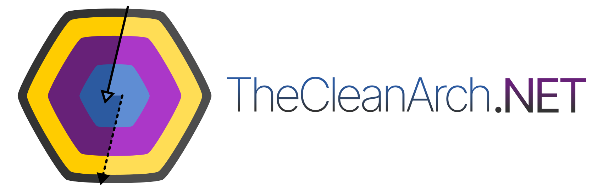

    


Mais uma implementação da definição de _"Arquitetura Limpa"_ conforme escrito por _Robert C. Martin (Uncle Bob)_ em seu artigo _"The Clean Architecture"_. Neste caso, implementamos para .NET.

* [Licenciado sob _Apache License 2.0_](LICENSE)
* [Código de conduta da comunidade](CODE_OF_CONDUCT.md)
* [Como contribuir?](CONTRIBUTING.md)

| Pacote | Versão |
| ------ | ----------------- |
| TheCleanArch.Core  |   |
| TheCleanArch.Enterprise  |   |
| TheCleanArch.Application  |   |
| TheCleanArch.InterfaceAdapter  |   |

# Início rápido

```sh
# 1. Instale os templates
dotnet new install TheCleanArch.Templates

# 2. Crie sua solução
dotnet new tca-basic-solution -n Solucao -o ./solucao
```

Pronto. Agora é só "codar" 😄!