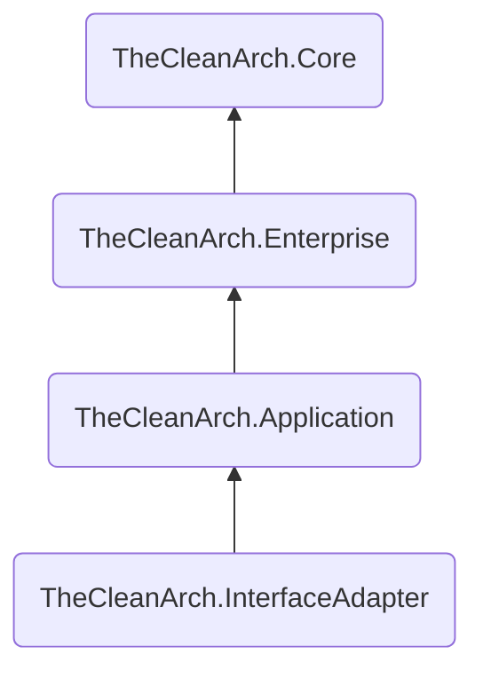

# Habilite _The Clean Arch_

Agora que você já tem um diretório de solução organizado e já com alguns componentes criados, precisamos _habilitar_ os componentes de software fornecidos como bibliotecas _The Clean Arch_. Basicamente vamos incluir uma dependência de biblioteca em cada componente que criamos de acordo com a camada que ele faz parte, e iremos _"marcá-los"_ assim.

A biblioteca mais básica de componentes fornecida por _The Clean Arch_ é `TheCleanArch.Core` ([Veja no NuGet.org][CORE_ON_NUGETORG]). Você pode usar essa biblioteca para se beneficiar dos utilitários gerais e codificar o que precisar. Porém usaremos outras bibliotecas voltadas exclusivamente para uso em cada camada, e essas bibliotecas já incluem `TheCleanArch.Core` como dependência para que você tenha esses utilitários sempre disponíveis.

Esses são as bibliotecas que usaremos e como estão relacionadas.


Essas bibliotecas estão prontas para uso em cada camada de nossa aplicação, e como você pode perceber na imagem anterior, elas já obedecem a _Regra de Dependência_ estabelecida por nossas definições de _Arquitetura Limpa_.

O que temos que fazer agora é adicionar a biblioteca adequada como dependência em cada um dos componentes de nossa solução.

 e nossas camadas de infraestrutura e apresentação dependerão de `TheCleanArch.InterfaceAdapter`.

```sh
# A camada de domínio depende de "TheCleanArch.Enterprise"
dotnet add src/Age.Domain/Age.Domain.csproj package TheCleanArch.Enterprise --prerelease

# A camada de aplicação depende de "TheCleanArch.Application"
dotnet add src/Age/Age.csproj package TheCleanArch.Application --prerelease

# A camada de apresentação e infraestrutura dependem de "TheCleanArch.InterfaceAdapter"
dotnet add src/Age.InMemoryStorage/Age.InMemoryStorage.csproj package TheCleanArch.InterfaceAdapter --prerelease
dotnet add src/Age.WebApi/Age.WebApi.csproj package TheCleanArch.InterfaceAdapter --prerelease
```

Isso é o suficiente para que você tenha os utilitários necessários de cada camada disponíveis para uso. Isso o habilita a codificar seguindo os padrões _"The Clean Arch"_ no contexto específico de cada camada na arquitetura proposta.

Mas para deixar isso mais explícito, e também para uso posterior de ferramentas de verificação e validação da saúde arquitetônica de sua aplicação, vamos criar alguns arquivos para facilitar a codificação e _"marcar"_ cada componente com o identificador de sua camada.

Primeiro altere todos seus arquivos `.csproj` removendo as propriedades `ImplicitUsings` e `Nullable`:
```diff
  <PropertyGroup>
     <TargetFramework>net8.0</TargetFramework>
-    <ImplicitUsings>enable</ImplicitUsings>
-    <Nullable>enable</Nullable>
  </PropertyGroup>
```

Vamos definir essas propriedades e outras de forma comum para todos os componentes. Então crie o arquivo `src/Directory.build.props` com o seguinte conteúdo:
```xml
<Project>
    <PropertyGroup>
        <Product>Age</Product>
        <AnalysisLevel>8.0-recommended</AnalysisLevel>
        <EnforceCodeStyleInBuild>true</EnforceCodeStyleInBuild>
        <ImplicitUsings>disable</ImplicitUsings>
        <Nullable>disable</Nullable>
        <!-- Informe aqui todas as outras propriedades que queira
             e sejam comuns a todos os componentes -->
    </PropertyGroup>
</Project>
```

> [!TIP]
> Aprenda mais sobre [personalização de build por diretório][CUSTOMIZE_BYDIRECTORY] na documentação oficial!

Agora vamos criar em cada componente (diretório dentro de `src/`) um arquivo chamado `Usings.cs` e nele vamos definir as cláusulas _usings globais_. Recomendamos essa abordagem do que apenas habilitar a propriedade `<ImplicitUsings>` para ser mais _explícito_ do que _implícito_.

Este é o conteúdo de cada arquivo:
```cs
global using TheCleanArch.Core;
global using TheCleanArch.Core.Patterns.GuardClauses;
```

> [!NOTE]
> Neste arquivo em cada projeto inclua as cláusulas `using` que forem relevantes para cada projeto

Agora crie um arquivo `AssemblyInfo.cs` em cada projeto, e use o trecho de código abaixo para marcar (anotar) o `Assembly` com metadados que indicam o _Id_ da camada a que pertence.

```cs
// File: src/Age.Domain/AssemblyInfo.cs
using static TheCleanArch.Core.ArchLayerId;

[assembly: ArchLayer(Enterprise, nameof(Enterprise))]
```

```cs
// File: src/Age/AssemblyInfo.cs
using static TheCleanArch.Core.ArchLayerId;

[assembly: ArchLayer(Application, nameof(Application))]
```

```cs
// File: src/Age.InMemoryStorage/AssemblyInfo.cs
using static TheCleanArch.Core.ArchLayerId;

[assembly: ArchLayer(InterfaceAdapter, nameof(InterfaceAdapter))]
```

```cs
// File: src/Age.WebApi/AssemblyInfo.cs
using static TheCleanArch.Core.ArchLayerId;

[assembly: ArchLayer(InterfaceAdapter, nameof(InterfaceAdapter))]
```

<!-- links -->
[CORE_ON_NUGETORG]: https://www.nuget.org/packages/TheCleanArch.Core#readme-body-tab
[CUSTOMIZE_BYDIRECTORY]: https://learn.microsoft.com/pt-br/visualstudio/msbuild/customize-by-directory