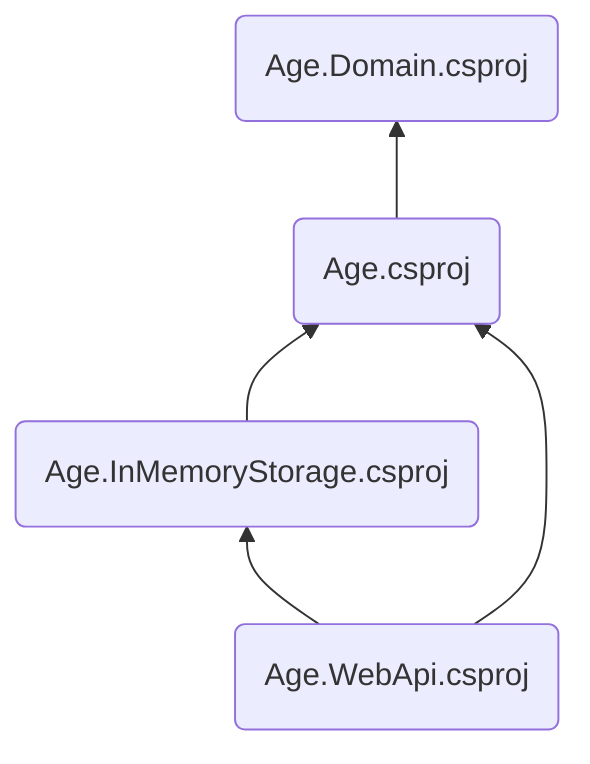

# Início rápido

A maneira mais prática de usar _The Clean Arch_ é criar uma solução nos moldes que se propõe. Então aqui iremos criar uma solução .NET em camadas para que você esteja apto a conhecer melhor cada componente da arquitetura em seus detalhes.

À partir de agora vamos trabalhar tendo em mente uma aplicação para controle de nossa [árvore genealógica.][ARVORE_GENEALOGICA]. A princípio vamos trabalhar na construção de uma _API Web_, mas poderia ser qualquer outro tipo de aplicação. Vamos então chamar nossa solução de _"Árvore Genealógica"_, a que podemos usar o _token_ _"ArvoreGenealogica"_ para identificar ou ainda _"Age"_ para ser mais curto.

1. Crie um diretório para a solução com uma estrutura mínima.

# [PowerShell](#tab/pwsh)
```sh
mkdir age-project
cd age-project

mkdir docs,eng,samples,src,test
```

# [Shell Script](#tab/sh)
```sh
mkdir age-project
cd age-project

mkdir {docs,eng,samples,src,test}
```

---

> [!TIP]
> Deste momento em diante, vamos imaginar que você estará sempre neste diretório de solução.

> [!WARNING]
> Outra coisa que iremos considerar é que você já tem o [.NET SDK][DOTNET] instalado e pronto para uso. Aqui usaremos a versão 8 como exemplo, mas à partir da versão 6 já é compatível.

2. Crie alguns arquivos essenciais. Configuração [NuGet][NUGET], [Git][GIT], [editor][EDITORCONFIG], etc.
```sh
dotnet new nugetconfig
dotnet new globaljson --sdk-version "8.0.0" --roll-forward feature
dotnet new gitignore
dotnet new editorconfig
dotnet new tool-manifest
```

E é isso que temos até o momento:
```console
./age-project
  ├── .config
  │   └── dotnet-tools.json
  ├── docs
  ├── eng
  ├── samples
  ├── src
  ├── test
  ├── .editorconfig
  ├── .gitignore
  ├── global.json
  └── nuget.config
```

> [!NOTE]
> Muitos dos itens que criamos aqui (diretórios e arquivos) nem precisavam ser criados, porque não influenciam diretamente na organização de nossa arquitetura, mas queremos deixar claro desde já que a forma como estruturamos nossos diretórios de solução tem impacto direto com nossa definição de arquitetura. Afinal a arquitetura vem para ajudar na forma como mantemos nosso código, e padrões são muito bem vindos, inclusive na forma como estruturamos nossos arquivos de código. Se acostume com este padrão desde já.

> [!TIP]
> Na vida real usaremos nossos templates de projeto para criar tudo isso, mas por hora vamos fazê-los manualmente para que você saiba que não há nenhuma mágica aqui.

3. Crie os projetos de cada camada do software

# [Enterprise](#tab/enterprise)
Nossa camada de regras organizacionais se chamará **Age.Domain**.
```sh
dotnet new classlib -n Age.Domain -o src/Age.Domain
```

# [Application](#tab/application)
Nossa camada de regras de aplicação se chamará **Age** apenas, porque é a aplicação em si.
```sh
dotnet new classlib -n Age -o src/Age
```

# [Interface Adapter](#tab/interface-adapter)

> [!NOTE]
> Os adaptadores de interface podem ser tantos quanto você precisar. Aqui usaremos apenas 2 componentes adaptadores: 1) a camada de apresentação como um adaptador de interface para entrada dos dados, e 2) a camada de acesso a dados como adaptador de interface para saída de dados.

Um adaptadore de interface para armazenamento de dados em memória chamado **Age.InMemoryStorage** e um adaptador de interface para API Web chamado **Age.WebApi**.

```sh
dotnet new classlib -n Age.InMemoryStorage -o src/Age.InMemoryStorage
dotnet new webapi --use-controllers -f net8.0 -n Age.WebApi -o src/Age.WebApi
```

---

Agora vamos relacionar esses projetos entre si de acordo com suas dependências.



```sh
dotnet add src/Age/Age.csproj reference src/Age.Domain/Age.Domain.csproj
dotnet add src/Age.InMemoryStorage reference src/Age/Age.csproj
dotnet add src/Age.WebApi reference src/Age.InMemoryStorage/Age.InMemoryStorage.csproj
dotnet add src/Age.WebApi reference src/Age/Age.csproj
```

Por fim, vamos reunir todos os componentes em um arquivo de solução .NET.

```sh
dotnet new sln -n Age

dotnet sln Age.sln add src/Age/Age.csproj
dotnet sln Age.sln add src/Age.Domain/Age.Domain.csproj
dotnet sln Age.sln add src/Age.InMemoryStorage/Age.InMemoryStorage.csproj
dotnet sln Age.sln add src/Age.WebApi/Age.WebApi.csproj
```

Isso nos leva a uma estrutura de diretórios e arquivos semelhantes a esta:

```console
./age-project
  ├─ .config/
  │  └─ dotnet-tools.json
  ├─ docs/
  ├─ eng/
  ├─ samples/
  ├─ src/
  │  ├─ Age/
  │  ├─ Age.Domain/
  │  ├─ Age.InMemoryStorage/
  │  └─ Age.WebApi/
  ├─ test/
  ├─ .editorconfig
  ├─ .gitignore
  ├─ Age.sln
  ├─ global.json
  └─ nuget.config
```

> [!TIP]
> Experimente a ferramenta [DependenSee][DEPENDENSEE] para visualizar um gráfico de dependências dos seus projetos.

Agora veja como a relação entre o gráfico de dependências de nossos projetos com as camadas de _"The Clean Arch"_ se encaixam perfeitamente.


Meus parabéns :clap: :clap: !!! Você acaba de criar um esboço de solução .NET de arquitetura limpa de acordo com _"The Clean Arch"_ :wink:.

Óbvio que isso não é tudo. Porém o primeiro passo para que você desenvolva de acordo com uma definição de _"Arquitetura Limpa"_, é estruturar seu projeto de software de forma a codificar nas camadas corretas e que essas camadas estejam dispostas de forma a seguir os princípios estabelecidos por _"The Clean Arch"_. Você aprenderá mais nos próximos passos.

[ARVORE_GENEALOGICA]: https://pt.wikipedia.org/wiki/%C3%81rvore_geneal%C3%B3gica
[DOTNET]: https://dot.net
[ASPNET_CORE]: https://asp.net
[DEPENDENSEE]: https://github.com/madushans/DependenSee
[NUGET]: https://www.nuget.org
[GIT]: https://git-scm.com
[EDITORCONFIG]: https://editorconfig.org