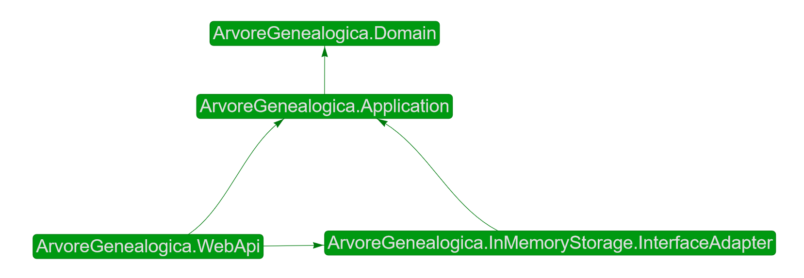

# Início rápido

A maneira mais prática de usar _The Clean Arch_ é criar uma solução nos moldes que se propõe. Então aqui iremos criar uma solução .NET em camadas para que você esteja apto a conhecer melhor cada componente da arquitetura em seus detalhes.

À partir de agora vamos trabalhar tendo em mente uma aplicação para controle de nossa [árvore genealógica.][ARVORE_GENEALOGICA]. A princípio vamos trabalhar na construção de uma _API Web_, mas poderia ser qualquer outro tipo de aplicação. Vamos então chamar nossa solução de _"Árvore Genealógica"_, a que usaremos o _token_ _"ArvoreGenealogica"_ para tal daqui em diante.

1. Crie um diretório para a solução com uma estrutura mínima.
```sh
mkdir arvore-genealogica-project
cd arvore-genealogica-project

mkdir docs
mkdir eng
mkdir src
mkdir test
```

> [!TIP]
> Deste momento em diante, vamos imaginar que você estará sempre neste diretório de solução.

> [!WARNING]
> Outra coisa que iremos considerar é que você já tem o [.NET SDK][DOTNET] instalado e pronto para uso. Aqui usaremos a versão 8 como exemplo, mas à partir da versão 6 já é compatível.

2. Crie alguns arquivos essenciais. Configuração [NuGet][NUGET], [Git][GIT], [editor][EDITORCONFIG], etc.
```sh
dotnet new nugetconfig
dotnet new globaljson --sdk-version "8.0.0" --roll-forward feature
dotnet new gitignore
dotnet new editorconfig
dotnet new tool-manifest
```

E é isso que temos até o momento:
```console
./arvore-genealogica-project
  ├─ .config/
  │  └─ dotnet-tools.json
  ├─ docs/
  ├─ eng/
  ├─ src/
  ├─ test/
  ├─ .editorconfig
  ├─ .gitignore
  ├─ global.json
  └─ nuget.config
```

> [!NOTE]
> Muitos dos itens que criamos aqui (diretórios e arquivos) nem precisavam ser criados, porque não influenciam diretamente na organização de nossa arquitetura, mas queremos deixar claro desde já que a forma como estruturamos nossos diretórios de solução tem impacto direto com nossa definição de arquitetura. Afinal a arquitetura vem para ajudar na forma como mantemos nosso código, e padrões são muito bem vindos, inclusive na forma como estruturamos nossos arquivos de código. Se acostume com este padrão desde já.

> [!TIP]
> Na vida real usaremos nossos templates de projeto para criar tudo isso, mas por hora vamos fazê-los manualmente para que você saiba que não há nenhuma mágica aqui.

3. Crie os projetos de cada camada do software

# [1. Enterprise](#tab/enterprise)
Nossa camada de regras organizacionais se chamará **ArvoreGenealogica.Domain**.
```sh
dotnet new classlib -n ArvoreGenealogica.Domain \
-o ./src/ArvoreGenealogica.Domain
```

# [2. Application](#tab/application)
Nossa camada de regras de aplicação se chamará **ArvoreGenealogica.Application**.
```sh
dotnet new classlib -n ArvoreGenealogica.Application \
-o ./src/ArvoreGenealogica.Application
```

# [3. Interface Adapter](#tab/interface-adapter)

> [!NOTE]
> Não queremos gerar confusões quanto a componentes de infraestrutura, e essa pode ser uma decisão adiata o quanto for possível. É possível inclusive desenvolver uma aplicação completa sem definir nenhum componente de infraestrutura inicialmente, mas como é bastante comum pelo menos termos armazenamento em bancos de dados, vamos criar um único componente para armazenamento dos dados explicitamente em memória. Mas tenha em mente que os componentes de infraestrutura podem ser tantos quantos você precisar.

Aqui criaremos um componente da camada de adaptadores de interface para armazenamento de dados em memória chamado **ArvoreGenealogica.InMemoryStorage.InterfaceAdapter**.

```sh
dotnet new classlib -n ArvoreGenealogica.InMemoryStorage.InterfaceAdapter \
-o ./src/ArvoreGenealogica.InMemoryStorage.InterfaceAdapter
```

# [4. External](#tab/external)
As camadas de apresentação são as mais comuns do tipo externas, e você também pode ter várias assim como as camadas de infraestrutura. No nosso exemplo vamos focar em apenas uma _API Web_.

Criaremos um componente da camada externa usando o [Framework ASP.NET Core][ASPNET_CORE] chamado **ArvoreGenealogica.WebApi**.
```sh
dotnet new webapi -controllers -f net8.0 -n ArvoreGenealogica.WebApi \
-o ./src/ArvoreGenealogica.WebApi
```

---

Agora vamos relacionar esses projetos entre si de acordo com suas dependências.


```sh
# A camada de domínio não depende de ninguém

# A camada de aplicação depende da camada de domínio
cd ./src/ArvoreGenealogica.Application
dotnet add reference ../ArvoreGenealogica.Domain/ArvoreGenealogica.Domain.csproj
cd ../..

# A camada de adaptador de interface depende da camada de aplicação
cd ./src/ArvoreGenealogica.InMemoryStorage.InterfaceAdapter
dotnet add reference ../ArvoreGenealogica.Application/ArvoreGenealogica.Application.csproj
cd ../..

# A camada externa depende tanto da camada de aplicação quanto de todos da camada de adaptadores de interface
cd ./src/ArvoreGenealogica.WebApi
dotnet add reference ../ArvoreGenealogica.Application/ArvoreGenealogica.Application.csproj
dotnet add reference ../ArvoreGenealogica.InMemoryStorage.InterfaceAdapter/ArvoreGenealogica.InMemoryStorage.InterfaceAdapter.csproj
cd ../..
```

Agora vamos reunir todos os componentes em um arquivo de solução .NET.
```sh
dotnet new sln -n ArvoreGenealogica

# adicionando os projetos que acabamos de criar ao arquivo de solução
dotnet sln ./ArvoreGenealogica.sln add ./src/ArvoreGenealogica.Domain/ArvoreGenealogica.Domain.csproj
dotnet sln ./ArvoreGenealogica.sln add ./src/ArvoreGenealogica.Application/ArvoreGenealogica.Application.csproj
dotnet sln ./ArvoreGenealogica.sln add ./src/ArvoreGenealogica.InMemoryStorage.InterfaceAdapter/ArvoreGenealogica.InMemoryStorage.InterfaceAdapter.csproj
dotnet sln ./ArvoreGenealogica.sln add ./src/ArvoreGenealogica.WebApi/ArvoreGenealogica.WebApi.csproj
```

Até o momento, nosso diretório deve estar assim:
```console
./arvore-genealogica-project
  ├─ .config/
  │  └─ dotnet-tools.json
  ├─ docs/
  ├─ eng/
  ├─ src/
  │  ├─ ArvoreGenealogica.Application/
  │  ├─ ArvoreGenealogica.Domain/
  │  ├─ ArvoreGenealogica.InMemoryStorage.InterfaceAdapter/
  │  └─ ArvoreGenealogica.WebApi/
  ├─ test/
  ├─ .editorconfig
  ├─ .gitignore
  ├─ ArvoreGenealogica.sln
  ├─ global.json
  └─ nuget.config
```

Vamos usar a ferramenta [DependenSee][DEPENDENSEE] para visualizar um gráfico de como está nossa solução. Se você fizer isso no diretório de solução que acaba de criar, obterá um gráfico parecido com esse:


Agora vamos conectar com as camadas definidas conforme _"The Clean Arch"_ para validar se as dependências estão ok.


Meus parabéns :clap: :clap: :wink:!!! Você acaba de criar um esboço de solução .NET de arquitetura limpa de acordo com _"The Clean Arch"_.

Isso não é tudo, porém o primeiro passo para que você desenvolva de acordo com _"The Clean Arch"_ é estruturar seu projeto de software de forma a codificar nas camadas corretas e que tais camadas obedeçam aos princípios estabelecidos, e essa estrutura de solução está de acordo.

[ARVORE_GENEALOGICA]: https://pt.wikipedia.org/wiki/%C3%81rvore_geneal%C3%B3gica
[DOTNET]: https://dot.net
[ASPNET_CORE]: https://asp.net
[DEPENDENSEE]: https://github.com/madushans/DependenSee
[NUGET]: https://www.nuget.org/
[GIT]: https://git-scm.com/
[EDITORCONFIG]: https://editorconfig.org/