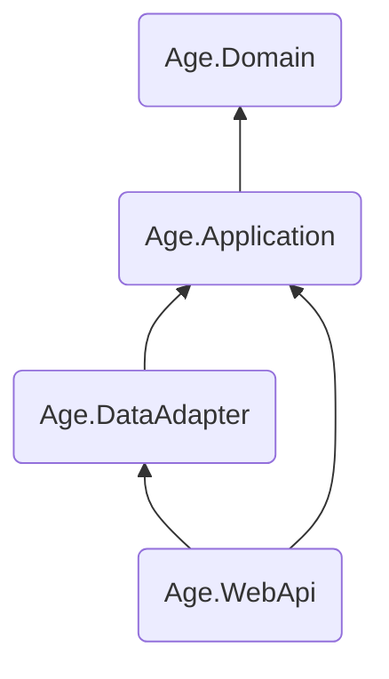

# 1. Crie a estrutura da solução

A maneira mais prática de usar _The Clean Arch_ é criar uma solução nos moldes que se propõe. Então aqui iremos criar uma solução [.NET][DOTNET] em camadas para que você esteja apto a conhecer melhor cada componente da arquitetura em seus detalhes.

À partir de agora vamos trabalhar tendo em mente uma aplicação para controle de nossa [árvore genealógica][ARVORE_GENEALOGICA]. A princípio vamos trabalhar na construção de uma _API Web_, mas poderia ser qualquer outro tipo de aplicação. Vamos então chamar nossa solução de _"Árvore Genealógica"_, a que podemos usar o _token_ _"ArvoreGenealogica"_ para identificar ou ainda _"Age"_ para ser mais curto.

## Diretório da solução

Crie um diretório para a solução com uma estrutura mínima.

```sh
mkdir age-project && cd age-project

mkdir docs
mkdir eng
mkdir samples
mkdir src
mkdir test
```

> [!TIP]
> Deste momento em diante, vamos imaginar que você estará sempre neste diretório de solução.

> [!WARNING]
> Outra coisa que iremos considerar é que você já tem o [.NET SDK][DOTNET] instalado e pronto para uso. Aqui usaremos a versão 10.0 como exemplo, mas à partir da versão 8 já somos compatíveis.

## Arquivos essenciais

Crie alguns arquivos essenciais. Configuração [NuGet][NUGET], [Git][GIT], [editor][EDITORCONFIG], etc.


```sh
dotnet new globaljson --sdk-version "10.0.100" --roll-forward feature
dotnet new nuget.config
dotnet new .gitignore
dotnet new .editorconfig
dotnet new tool-manifest
```

E é isso que temos até o momento:

```
./age-project
  ├── .config
  │   └── dotnet-tools.json
  ├── docs
  ├── eng
  ├── samples
  ├── src
  ├── test
  ├── .editorconfig
  ├── .gitignore
  ├── global.json
  └── nuget.config
```

> [!TIP]
> Na vida real usaremos nossos templates de projeto para criar tudo isso, mas por hora vamos fazê-los manualmente para que você saiba que não há nenhuma mágica aqui.

## Arquivos de projeto

Crie os projetos de cada camada do software.

### Enterprise

Nossa camada de regras organizacionais se chamará **Age.Business.Entities**, e residirá
em `src/Business/Entities`.
```sh
mkdir src/Business
dotnet new classlib -n Age.Business.Entities -o src/Business/Entities
```

### Use Cases

Nossa camada de regras de aplicação se chamará **Age.Business.UseCases**, e residirá
em `src/Business/UseCases`.
```sh
dotnet new classlib -n Age.Business.UseCases -o src/Business/UseCases
```

### Interface Adapter

> [!NOTE]
> Os adaptadores de interface podem ser tantos quanto você precisar. Aqui usaremos apenas dois: 1) a camada de apresentação como um adaptador de interface para entrada dos dados, e 2) a camada de acesso a dados como adaptador de interface para saída de dados.

Um adaptador de interface para armazenamento de dados chamado **Age.InterfaceAdapters.Data.MongoDB**
e um adaptador de interface para _Web API_ chamado **Age.InterfaceAdapters.UI.WebApi**,
e ambos residirão em `src/InterfaceAdapters`.

```sh
mkdir src/InterfaceAdapters

dotnet new classlib -n Age.InterfaceAdapters.Data.MongoDB -o src/InterfaceAdapters/Data.MongoDB
dotnet new webapi -n Age.InterfaceAdapters.UI.WebApi -o src/InterfaceAdapters/UI.WebApi
```

Agora vamos relacionar esses projetos entre si de acordo com suas dependências.

<!-- TODO: Ver a possibilidade de renomear TheCleanArch.Application 
           para TheCleanArch.UseCases ou modificar a documentação
           para considerar Application ao invés de UseCases -->



```sh
dotnet add src/Age.WebApi/Age.WebApi.csproj reference src/Age.DataAdapter/Age.DataAdapter.csproj
dotnet add src/Age.WebApi/Age.WebApi.csproj reference src/Age.Application/Age.Application.csproj
dotnet add src/Age.DataAdapter/Age.DataAdapter.csproj reference src/Age.Application/Age.Application.csproj
dotnet add src/Age.Application/Age.Application.csproj reference src/Age.Domain/Age.Domain.csproj
```

## Arquivo de solução

Por fim, vamos reunir todos os componentes em um arquivo de solução [.NET][DOTNET].

```sh
dotnet new sln -n Age -f slnx

dotnet sln add src/Age.Domain/Age.Domain.csproj
dotnet sln add src/Age.Application/Age.Application.csproj
dotnet sln add src/Age.DataAdapter/Age.DataAdapter.csproj
dotnet sln add src/Age.WebApi/Age.WebApi.csproj
```

## Conferindo tudo

Isso nos leva a uma estrutura de diretórios e arquivos semelhantes a esta:

```console
./age-project
  ├─ .config/
  │  └─ dotnet-tools.json
  ├─ docs/
  ├─ eng/
  ├─ samples/
  ├─ src/
  │  ├─ Age.Application/
  │  ├─ Age.DataAdapter/
  │  ├─ Age.Domain/
  │  └─ Age.WebApi/
  ├─ test/
  ├─ .editorconfig
  ├─ .gitignore
  ├─ Age.slnx
  ├─ global.json
  └─ nuget.config
```

> [!TIP]
> Experimente a ferramenta [DependenSee][DEPENDENSEE] para visualizar um gráfico de dependências dos seus projetos.

Agora veja como a relação entre o gráfico de dependências de nossos projetos com as camadas de _"The Clean Arch"_ se encaixam perfeitamente.


Meus parabéns! Você acaba de criar um esboço de solução [.NET][DOTNET] com arquitetura limpa de acordo com _"The Clean Arch"_ :wink:.

> [!TIP]
> Veja um [exemplo completo dessa solução no GitHub][AGE_SAMPLE_GITHUB]

Óbvio que isso não é tudo. Porém o primeiro passo para que você desenvolva de acordo com uma definição de _"Arquitetura Limpa"_ é estruturar seu projeto de software de forma a codificar nas camadas corretas e que essas camadas estejam dispostas de forma a seguir os princípios estabelecidos por _"The Clean Arch"_. Você aprenderá mais nos próximos passos.

[ARVORE_GENEALOGICA]: https://pt.wikipedia.org/wiki/%C3%81rvore_geneal%C3%B3gica
[DOTNET]: https://dot.net
[ASPNET_CORE]: https://asp.net
[DEPENDENSEE]: https://github.com/madushans/DependenSee
[NUGET]: https://www.nuget.org
[GIT]: https://git-scm.com
[EDITORCONFIG]: https://editorconfig.org
[AGE_SAMPLE_GITHUB]: https://github.com/Hibex-Solutions/TheCleanArch/tree/main/samples/AgeProject
