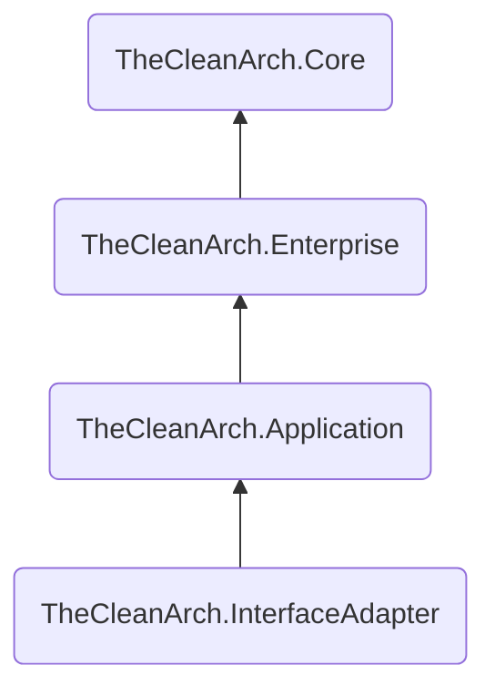

# 2. Habilite _The Clean Arch_

Agora que você já tem um diretório de solução organizado e com alguns componentes criados, precisamos _habilitar_ os componentes da bibliotecas _The Clean Arch_. Basicamente vamos incluir uma dependência de biblioteca em cada componente que criamos de acordo com a camada a que pertence, e iremos _"marcá-los"_ assim.

A biblioteca mais básica de componentes fornecida por _The Clean Arch_ é `TheCleanArch.Core` ([Veja no NuGet.org][CORE_ON_NUGETORG]). Você pode usar essa biblioteca para se beneficiar dos utilitários gerais e codificar o que precisar. Porém usaremos outras bibliotecas voltadas exclusivamente para uso em cada camada, e essas bibliotecas já incluem `TheCleanArch.Core` como dependência para que você tenha esses utilitários sempre disponíveis independente da camada.

Essas são as bibliotecas que usaremos e como estão relacionadas.


Essas bibliotecas estão prontas para uso em cada camada de nossa aplicação e levam os nomes dessas camadas, e como você pode perceber no gráfico anterior, elas já obedecem a _Regra de Dependência_ estabelecida por nossas definições de _Arquitetura Limpa_. A camada mais externa tem acesso a camada mais interna e o inverso não é permitido.

O que temos que fazer agora é adicionar a biblioteca adequada como dependência em cada um dos componentes de nossa solução.

```sh
# A camada de domínio depende de "TheCleanArch.Enterprise"
dotnet add src/Age.Domain/Age.Domain.csproj package TheCleanArch.Enterprise --prerelease

# A camada de aplicação depende de "TheCleanArch.Application"
dotnet add src/Age.Application/Age.Application.csproj package TheCleanArch.Application --prerelease

# A camada de acesso a dados e apresentação dependem de "TheCleanArch.InterfaceAdapter"
dotnet add src/Age.DataAdapter/Age.DataAdapter.csproj package TheCleanArch.InterfaceAdapter --prerelease
dotnet add src/Age.WebApi/Age.WebApi.csproj package TheCleanArch.InterfaceAdapter --prerelease
```

Isso é o suficiente para que você tenha os utilitários necessários de cada camada disponíveis para uso, além de o habilita a codificar seguindo os padrões _"The Clean Arch"_ no contexto da arquitetura proposta.

Mas para deixar isso mais explícito, e também para uso posterior de ferramentas de verificação e validação da saúde arquitetônica de sua aplicação, vamos criar alguns arquivos para facilitar a codificação e _"marcar"_ cada componente com o identificador de sua camada.

Primeiro altere todos seus arquivos `.csproj` removendo as propriedades `ImplicitUsings` e `Nullable`:
```diff
  <PropertyGroup>
     <TargetFramework>net10.0</TargetFramework>
-    <ImplicitUsings>enable</ImplicitUsings>
-    <Nullable>enable</Nullable>
  </PropertyGroup>
```

Vamos definir essas propriedades e outras de forma comum para todos os componentes. Então crie o arquivo `src/Directory.Build.props` com o seguinte conteúdo:
```xml
<Project>
    <PropertyGroup>
        <Product>Age</Product>
        <AnalysisLevel>10.0-recommended</AnalysisLevel>
        <EnforceCodeStyleInBuild>true</EnforceCodeStyleInBuild>
        <ImplicitUsings>disable</ImplicitUsings>
        <Nullable>enable</Nullable>
        <!-- Informe aqui todas as outras propriedades que queira
             e sejam comuns a todos os componentes -->
    </PropertyGroup>
</Project>
```

> [!TIP]
> Aprenda mais sobre [personalização de build por diretório][CUSTOMIZE_BYDIRECTORY] na documentação oficial!

Agora vamos criar em cada componente (diretório dentro de `src/`) um arquivo chamado `Usings.cs` e nele vamos definir as cláusulas _usings globais_. Recomendamos essa abordagem do que apenas habilitar a propriedade `<ImplicitUsings>` para ser mais _explícito_ do que _implícito_.

Este é o conteúdo de cada arquivo:
```cs
global using TheCleanArch.Core;
global using TheCleanArch.Core.Patterns.GuardClauses;
```

Com exceção do arquivo `Usings.cs` no projeto de API Web que tem mais informações:
```cs
global using System;
global using System.Collections.Generic;
global using System.Linq;
global using System.Net.Http.Json;

global using Microsoft.AspNetCore.Builder;
global using Microsoft.AspNetCore.Http;
global using Microsoft.AspNetCore.Routing;
global using Microsoft.Extensions.Configuration;
global using Microsoft.Extensions.DependencyInjection;
global using Microsoft.Extensions.Hosting;
global using Microsoft.Extensions.Logging;

global using TheCleanArch.Core;
global using TheCleanArch.Core.Patterns.GuardClauses;
```

> [!NOTE]
> Perceba que neste arquivo em cada projeto nós incluímos as cláusulas `using` que forem relevantes para cada projeto.
> Ele não é o mesmo para todos os projetos, mas contém as cláusulas `using` que devem estar disponíveis em qualquer lugar do código.
> Ou seja, preferimos e recomendamos o uso de [_global using directive_][GLOBALUSING] de forma explícita no arquivo `Usings.cs` em detrimento a configuração [_implicit using directives_][IMPLICITUSING] nos arquivos de projeto.

Agora crie um arquivo `AssemblyInfo.cs` em cada projeto, e use o trecho de código abaixo para marcar (anotar) o `Assembly` com metadados que identificam a camada a que pertencem.

```cs
# [src/Age.Domain/AssemblyInfo.cs](#tab/domain)
using static TheCleanArch.Core.ArchLayerId;

[assembly: ArchLayer(Enterprise, nameof(Enterprise))]

# [src/Age.Application/AssemblyInfo.cs](#tab/application)
using static TheCleanArch.Core.ArchLayerId;

[assembly: ArchLayer(Application, nameof(Application))]

# [src/Age.DataAdapter/AssemblyInfo.cs](#tab/dataadapter)
using static TheCleanArch.Core.ArchLayerId;

[assembly: ArchLayer(InterfaceAdapter, nameof(InterfaceAdapter))]

# [src/Age.WebApi/AssemblyInfo.cs](#tab/webapi)
using static TheCleanArch.Core.ArchLayerId;

[assembly: ArchLayer(InterfaceAdapter, nameof(InterfaceAdapter))]

---
```

Agora além ter os componentes prontos para codificar já com os utilitários _The Clean Arch_, acabamos com alguns arquivos novos (`AssemblyInfo.cs` e `Usings.cs`).

> [!TIP]
> Podemos considerar esses dois novos arquivos como padrão para qualquer componente que criarmos daqui pra frente.

Teremos no mínimo 3 (três) arquivos em cada componente. Veja um exemplo de nossa camada de aplicação:
```console
./Age.Aplication
  ├── AssemblyInfo.cs
  ├── Usings.cs
  └── Age.Application.csproj
```

Agora nossos componentes de software estão prontos para serem codificados pois já temos o mínimo da solução configurada. Nos próximos passos prepararemos nossos editores, e o mínimo necessário para permitir [testes unitários][UNIT_TEST].

<!-- links -->
[CORE_ON_NUGETORG]: https://www.nuget.org/packages/TheCleanArch.Core#readme-body-tab
[CUSTOMIZE_BYDIRECTORY]: https://learn.microsoft.com/pt-br/visualstudio/msbuild/customize-by-directory
[UNIT_TEST]: https://en.wikipedia.org/wiki/Unit_testing
[GLOBALUSING]: https://learn.microsoft.com/pt-br/dotnet/csharp/language-reference/keywords/using-directive#global-modifier
[IMPLICITUSING]: https://learn.microsoft.com/pt-br/dotnet/core/project-sdk/overview#implicit-using-directives