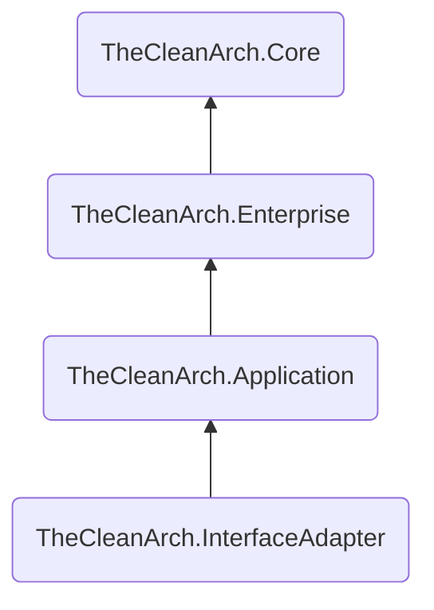

# 2. Habilite _TheCleanArch_

Agora que você já tem um diretório de solução organizado e com alguns
componentes criados, precisamos _habilitar_ os componentes da bibliotecas
_TheCleanArch_. Basicamente vamos incluir uma dependência de biblioteca em cada
componente que criamos de acordo com a camada a que pertence, e iremos
_"marcá-los"_ assim.

A biblioteca mais básica de componentes fornecida por _The Clean Arch_ é
`TheCleanArch.Core` ([Veja no NuGet.org][CORE_ON_NUGETORG]). Você pode usar
essa biblioteca para se beneficiar dos utilitários gerais e codificar o que
precisar. Porém usaremos outras bibliotecas voltadas exclusivamente para uso em
cada camada, e essas bibliotecas já incluem `TheCleanArch.Core` como
dependência para que você tenha esses utilitários sempre disponíveis
independente da camada.

Essas são as bibliotecas que usaremos e como estão relacionadas.

```mermaid
flowchart BT

Core(TheCleanArch.Core)
Enterprise(TheCleanArch.Enterprise)
Application(TheCleanArch.Application)
InterfaceAdapter(TheCleanArch.InterfaceAdapter)


InterfaceAdapter --> Application
Application --> Enterprise
Enterprise --> Core
```

Essas bibliotecas estão prontas para uso em cada camada de nossa aplicação e
levam os nomes dessas camadas, e como você pode perceber no gráfico anterior,
elas já obedecem a _Regra de Dependência_ estabelecida por nossas definições de
_Arquitetura Limpa_. A camada mais externa tem acesso a camada mais interna e
o inverso não é permitido.

> [!IMPORTANT]
> Porque quando criamos nossa aplicação demos os nomes das camadas de
> **Entities** e **UseCases**, mas os componentes da biblioteca se chamam
> **Enterprise** e **Application**?. Não seria menos confuso usar os mesmos
> nomes? Acontece que, para nossa aplicação criamos a _"camada"_ **Entities**
> para _"conter as regras"_ **Enterprise** (da organização), e a _"camada"_
> **UseCases** para _"conter as regras"_ **Application** (da aplicação).
> Essa é a relação.

O que temos que fazer agora é adicionar a biblioteca adequada como dependência
em cada um dos componentes de nossa solução.

```sh
# A camada Entities depende de "TheCleanArch.Enterprise"
# cd src/Business/Entities
dotnet package add TheCleanArch.Enterprise --prerelease

# A camada UseCases depende de "TheCleanArch.Application"
# cd src/Business/UseCases
dotnet package add TheCleanArch.Application --prerelease

# As camadas InterfaceAdapters dependem de "TheCleanArch.InterfaceAdapter"
# cd src/InterfaceAdapters/Data.MongoDB
dotnet package add TheCleanArch.InterfaceAdapter --prerelease

# cd src/InterfaceAdapters/UI.WebApi/
dotnet package add TheCleanArch.InterfaceAdapter --prerelease
```

Isso é o suficiente para que você tenha os utilitários necessários de cada
camada disponíveis para uso, além de o habilitar na codificação seguindo os
padrões propostos por _"TheCleanArch"_.

Mas para deixar isso mais explícito, e também para uso posterior de ferramentas
de verificação e validação da saúde arquitetônica de sua aplicação, vamos criar
alguns arquivos para facilitar a codificação e _"marcar"_ cada componente com o
identificador de sua camada.

Primeiro altere todos seus arquivos `.csproj` removendo as propriedades
`ImplicitUsings` e `Nullable`:
```diff
  <PropertyGroup>
     <TargetFramework>net10.0</TargetFramework>
-    <ImplicitUsings>enable</ImplicitUsings>
-    <Nullable>enable</Nullable>
  </PropertyGroup>
```

Vamos definir essas propriedades e outras globalmente para uso comum em todos os
componentes. Então crie o arquivo `Directory.Build.props` na raiz da solução:
```xml
<Project>
    <PropertyGroup>
        <Product>Age</Product>
        <AnalysisLevel>10.0-recommended</AnalysisLevel>
        <EnforceCodeStyleInBuild>true</EnforceCodeStyleInBuild>
        <ImplicitUsings>disable</ImplicitUsings>
        <Nullable>enable</Nullable>
        <!-- Informe aqui todas as outras propriedades que queira
             e sejam comuns a todos os componentes -->
    </PropertyGroup>
</Project>
```

> [!TIP]
> Aprenda mais sobre [personalização de build por diretório][CUSTOMIZE_BYDIRECTORY]
> na documentação oficial!

Agora vamos criar em cada componente (diretório dentro de `src/`) um arquivo
chamado `Usings.cs` e nele vamos definir as cláusulas _usings globais_.
Recomendamos essa abordagem do que apenas habilitar a propriedade
`<ImplicitUsings>` porque _explícito_ é melhor que _implícito_.

Este é o conteúdo de cada arquivo:
```cs
global using System;
global using System.Collections.Generic;
global using System.IO;
global using System.Linq;
global using System.Threading;
global using System.Threading.Tasks;

global using TheCleanArch.Core;
global using TheCleanArch.Core.Patterns.GuardClauses;
```

Com exceção do arquivo `Usings.cs` no projeto de API Web que tem mais
informações:
```cs
global using System;
global using System.Collections.Generic;
global using System.IO;
global using System.Linq;
global using System.Threading;
global using System.Threading.Tasks;
global using System.Net.Http;
global using System.Net.Http.Json;

global using Microsoft.AspNetCore.Builder;
global using Microsoft.AspNetCore.Http;
global using Microsoft.AspNetCore.Routing;
global using Microsoft.Extensions.Configuration;
global using Microsoft.Extensions.DependencyInjection;
global using Microsoft.Extensions.Hosting;
global using Microsoft.Extensions.Logging;

global using TheCleanArch.Core;
global using TheCleanArch.Core.Patterns.GuardClauses;
```

> [!NOTE]
> Perceba que neste arquivo em cada projeto nós incluímos as cláusulas `using`
> que forem relevantes para cada projeto. Ele não é o mesmo para todos os
> projetos, mas contém as cláusulas `using` que devem estar disponíveis em
> qualquer lugar do código. Ou seja, preferimos e recomendamos o uso de
> [_global using directive_][GLOBALUSING] de forma explícita no arquivo
> `Usings.cs` em detrimento a configuração
> [_implicit using directives_][IMPLICITUSING] nos arquivos de projeto.

Agora crie um arquivo `AssemblyInfo.cs` em cada projeto, e use o trecho de
código abaixo para marcar (anotar) o `Assembly` com metadados que identificam
a camada a que pertencem.

```cs
// src/Business/Entities/AssemblyInfo.cs
using static TheCleanArch.Core.ArchLayerId;

[assembly: ArchLayer(Enterprise, nameof(Enterprise))]
```

```cs
// src/Business/UseCases/AssemblyInfo.cs
using static TheCleanArch.Core.ArchLayerId;

[assembly: ArchLayer(Application, nameof(Application))]
```

```cs
// src/InterfaceAdapters/Data.MongoDB/AssemblyInfo.cs
using static TheCleanArch.Core.ArchLayerId;

[assembly: ArchLayer(InterfaceAdapter, nameof(InterfaceAdapter))]
```

```cs
// src/InterfaceAdapters/UI.WebApi/AssemblyInfo.cs
using static TheCleanArch.Core.ArchLayerId;

[assembly: ArchLayer(InterfaceAdapter, nameof(InterfaceAdapter))]
```

---

Agora além ter os componentes prontos para codificar já com os utilitários
_TheCleanArch_, incluimos alguns arquivos novos (`AssemblyInfo.cs` e
`Usings.cs`).

> [!TIP]
> Podemos considerar esses dois novos arquivos como padrão para qualquer
componente que criarmos daqui pra frente.

Teremos no mínimo 3 (três) arquivos em cada componente. Veja um exemplo de
nossa camada _UseCases_:
```console
./src/Business/UseCases
  ├── Age.Business.UseCases.csproj
  ├── AssemblyInfo.cs
  └── Usings.cs
```

Agora nossos componentes de software estão prontos para serem codificados pois
já temos o mínimo da solução configurada. E nos próximos passos prepararemos
nossos editores, e o mínimo necessário para permitir
[testes unitários][UNIT_TEST].

<!-- links -->
[CORE_ON_NUGETORG]: https://www.nuget.org/packages/TheCleanArch.Core#readme-body-tab
[CUSTOMIZE_BYDIRECTORY]: https://learn.microsoft.com/pt-br/visualstudio/msbuild/customize-by-directory
[UNIT_TEST]: https://en.wikipedia.org/wiki/Unit_testing
[GLOBALUSING]: https://learn.microsoft.com/pt-br/dotnet/csharp/language-reference/keywords/using-directive#global-modifier
[IMPLICITUSING]: https://learn.microsoft.com/pt-br/dotnet/core/project-sdk/overview#implicit-using-directives