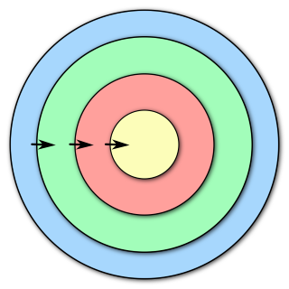

# Introdução

O termo _Clean Architecture_ (Arquitetura Limpa) foi cunhado inicialmente por _Robert C. Martin (Uncle Bob)_ por volta de 2008, e envolve uma série de boas práticas para o desenvolvimento de software de forma sustentável. Desde então muitas pessoas vem procurando exclarecer e implementar essa boas práticas em várias tecnologias.

Existem porém muitas formas de fazer a mesma coisa, e elas não estão necessariamente erradas, mas apenas são diferentes. É claro que também existem muitos equívocos em algumas implementações que estão disponíveis por aí na Web, mas a grande maioria está Ok com os princípios.

O projeto _"The Clean Arch"_ é apenas mais uma dessas implementações, porém aqui queremos disponibilizar um conjunto de bibliotecas utilitárias, mais essa documentação; para que possa se tornar o ponto inicial para você desenvolver seus softwares (inicialmente em .NET - mas queremos amplicar a outras linguagens). O conjunto de bibliotecas pretende ser mínimo para não forçá-lo a deixar de usar as suas preferidas, mas o suficiente para que você possa de fato implementar uma _arquitetura limpa_ como descrito pelo _Tio Bob_.

> [!TIP]
> Leia o artigo do _Tio Bob_ em https://blog.cleancoder.com/uncle-bob/2012/08/13/the-clean-architecture.html

No artigo (em buscando pela Internet) você vai encontrar a famosa imagem _"The Clean Architecture".

Nem todos os pontos desta imagem ficam claros para todos os leitores, mas se você se dedicar no entendimento tanto do artigo, quanto dos links relacionados que falam sobre outras definições de arquitetura.

> [!NOTE]
> Vale ressaltar que _Uncle Bob_ reúne ideias de vários outros autores que caminham na mesma direção de seu entendimento quanto a arquitetura de software, e tenta reuní-los nas definições apontadas pelo artigo. Ele não cria a _Arquitetura Limpa_, apenas a descreve de forma resumida.

Se tirarmos algumas informações da imagem, podemos chegar ao seguinte resumo:

Esse imagem acima talvez seja o resumo da _Arquitetura Limpa_ conforme a maioria se baseia para implementar. Mas por ironia ela acaba referenciando quase que diretamente uma das definições que se conhece e que o _Tio Bob_ se baseou. Estou falando da [_Onion Architecture (arquitetura cebola)_](jeffreypalermo.com/blog/the-onion-architecture-part-1/). E acaba deixando de fora alguns outros detalhes que nós entendemos muito importantes.

Então trabalhamos nesses detalhes e chegamos a este outro desenho:

.

Agora, à pesar de continuar com as mesmas regras de antes, temos um desenho mais resumido. O que fizemos aqui foi explicitar no desenho tanto a [_Onion Architecture (arquitetura cebola)_](jeffreypalermo.com/blog/the-onion-architecture-part-1/) mas também a [_Hexagonal Architecture_ ou ainda _Ports and Adapters Architecture_](https://alistair.cockburn.us/hexagonal-architecture/). Também tentamos resumir a regra de dependência (representada pelas setas) com o controle de fluxo (aquele desenho estranho no canto inferior direito da imagem original) através de duas setas agora, uma sólida de fora para dentro, representando acesso direto, e uma pontilhada de dentro pra fora, representando acesso indireto.

Por fim mudamos as cores porque temos gostos diferentes, e então chegamos a esta imagem:

Gostamos de pensar na _"The Clean Arch"_ como uma especialização da definição original de _"The Clean Architecture"_.

