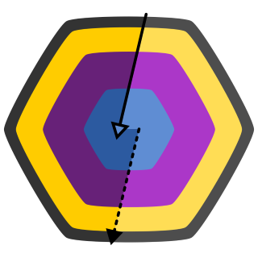
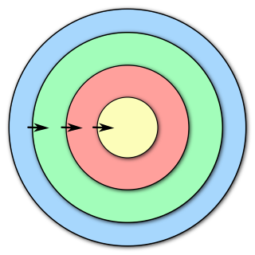
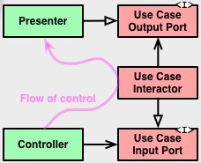
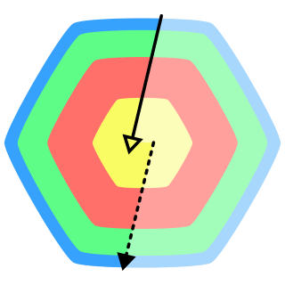

# A Imagem

Aqui temos a imagem que define o projeto _"The Clean Arch"_. Ela foi criada não apenas para ser usada como uma logo ou ícone, mas como um diagrama que reflete os pontos fundamentais da arquitetura em si. Olhando para ela você deve perceber rapidamente as regras da arquitetura. Ela é um guia da arquitetura em forma de imagem, afinal, _uma imagem não vela mais que mil palavras?_

Vamos então endender alguns detalhes dessa imagem para que você a possa ter em mente não mais como uma simples imagem, mas como um guia de arquitetura limpa.

## A imagem no artigo original

[No artigo original][BLOG_POST] você vai encontrar a famosa imagem _"The Clean Architecture".

Nem todos os pontos desta imagem ficam claros aos leitores, mas ela também foi feita para ser vista como um guia. Aqui temos as camadas em níveis da [Onion Architecture][ONION_PAGE], a regra de dependência explicitada, tanto na comunicação direta para o centro através das setas, quanto a comunicação indireta através de portas e adaptadores da [Hexagonal Architecture][HEXAGONAL_PAGE], além da nomeação das camadas principais da arquitetura.

Se isso não estiver claro, talvez devesse dedicar um tempinho a mais no entendimento tanto do artigo quanto dos links relacionados nele, e que falam sobre as outras definições de arquitetura.

## Simplificação da imagem

Nós procuramos simplificar essa imagem para que seja mais prático olhar para ela e perceber esses detalhes. Então partimos da imagem original, mas para isso removemos alguns detalhes dela e chegamos a essa imagem como sendo o ponto mais importante na imagem do artigo original:

Esse imagem acima talvez seja o resumo da _Arquitetura Limpa_ conforme a maioria se baseia para implementar. Mas por ironia ela acaba referenciando quase que diretamente uma das definições que se conhece e que o _Uncle Bob_ se baseou. Estou falando da [_Onion Architecture (arquitetura cebola)_][ONION_PAGE], e acaba deixando de fora alguns outros detalhes que nós entendemos muito importantes.

Ela também não é completa, está faltando essa outra imagem, que na verdade está presente em um cantinho da imagem original.

Ela representa a comunicação indireta entre as camadas internas com as camadas externas através de portas e adaptadores descritas pelas definições da [Hexagonal Architecture][HEXAGONAL_PAGE], também conhecida como _Ports and Adapters_.

Então o que fizemos foi simplificar a imagem nessa aqui, que reune essas duas primeiras imagens em uma única imagem:

.

Agora, à pesar de continuar com as mesmas regras de antes, temos um desenho mais resumido. O que fizemos aqui foi explicitar no desenho tanto a [Onion Architecture][ONION_PAGE] mas também não deixamos de fora a [Hexagonal Architecture][HEXAGONAL_PAGE], pois você pode percebê-las através do desenho principal de _"camadas hexagonais concêntricas"_. Também tentamos resumir a regra de dependência (representada pelas setas) com o controle de fluxo (aquele desenho estranho no canto inferior direito da imagem original). Agora temos duas setas, uma sólida de fora para dentro, representando acesso direto as camadas internas pelas camadas externas, e uma pontilhada de dentro pra fora, representando acesso indireto as camadas externas pelas camadas internas, e que é feito através de portas.

Por fim mudamos as cores porque temos gostos diferentes (kkk), e então chegamos a imagem do projeto _"The Clean Arch"_:

Você deve olhar para essa imagem e perceber as seguintes regras arquiteturais base:

1) Existem camadas dispostas concentricamente (como define "Onion Architecture")
2) É permitida a comunicação direta das camadas mais externas em direção ao centro
3) A comunicação partindo do centro às extremidades é feita de forma indireta (como define "Hexagonal Architecture")
4) As camadas são identificadas pelas cores relacionadas a seus nomes

Esses são os nomes e cores das camadas como as definimos, partindo do centro para a extremidade:

1)  **Enterprise**

    A primeira camada mais ao centro é chamada de **Camada de regras organizacionais** e nela estão codificadas as regras mais específicas do domínio, também é conhecida como _"camada de domínio"_. No desenho original está na cor _amarela_ e chamada de _"Enterprise Business Rules"_ ou _"Entities"_.

2)  **Application**

    A segunda camada é chamada de **Camada de regras de aplicação (Application)** e nela são codificadas as regras específicas da aplicação em si. No desenho original está na cor _salmão_ e chamada de _"Application Business Rules"_ ou _"Use Cases"_.

3)  **Interface Adapter**

    A terceira camada é chamada de **Camada de adaptadores de interface (Interface Adapter)** e é nela que residem as implementações dos adaptadores para portas de comunicação com bancos de dados, APIs externas, etc. Também conhecida como _camada de infraestrutura_. No desenho original está na cor _verde_ e chamada de _"Interface Adapters"_.

4)  **External**

    A camada mais a extremidade (quarta camada) é chamada de **Camada externa (External)** e é nela que residem os _frameworks_, _drivers_ e etc. No desenho original está na cor _azul_ e chamada de _"Frameworks & Drivers"_.

Gostamos de pensar em _"The Clean Arch"_ como uma especialização da definição original de _"The Clean Architecture"_.

<!-- links -->
[BLOG_POST]: https://blog.cleancoder.com/uncle-bob/2012/08/13/the-clean-architecture.html
[HEXAGONAL_PAGE]: https://alistair.cockburn.us/hexagonal-architecture/
[ONION_PAGE]: https://jeffreypalermo.com/2008/07/the-onion-architecture-part-1/
[SCREAMING_POST]: https://blog.cleancoder.com/uncle-bob/2011/09/30/Screaming-Architecture.html
[BOOK_AMAZON]: https://www.amazon.com.br/Arquitetura-Limpa-Artes%C3%A3o-Estrutura-Software/dp/8550804606
[DOTNET]: https://dot.net