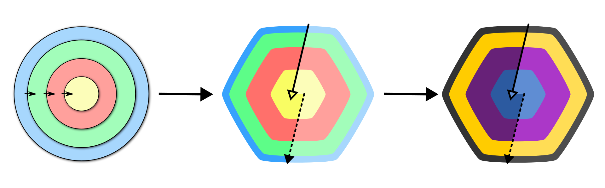

Essa é mais uma implementação da definição de _"Arquitetura Limpa"_ conforme escrito por _Robert C. Martin (Uncle Bob)_ em seu artigo _"The Clean Architecture"_. Neste caso, implementamos para .NET.

Gostamos de pensar em _"The Clean Arch"_ como uma especialização da definição original de _"The Clean Architecture"_.

Leia [nossa documentação](articles/introduction.md) ou vá direto ao [_Guia de Início Rápido_](articles/getting-started.md).